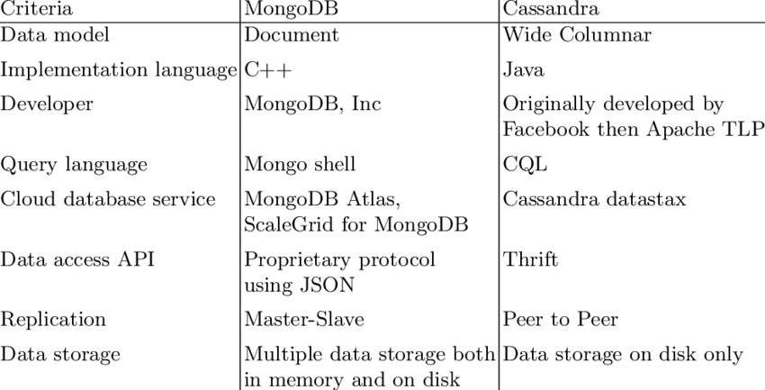

# Comparaison de deux Bases de Données NoSQL: MongoDB & Cassandra

## Introduction:
Les bases de données NoSQL sont un type de bases de données non relationnelles qui sont devenues populaires ces dernières années en raison de leur flexibilité, de leur évolutivité et de leur capacité à gérer de grands volumes de données non structurées.

Dans ce projet, nous allons comparer deux bases de données NoSQL populaires: MongoDB et Cassandra. Nous examinerons leurs avantages et leurs limites, leur fonctionnement et leur architecture, et leur relation avec le théorème CAP. Nous installerons également les deux outils et chargerons des données suffisantes dans les deux afin de faire des comparaisons plus objectives.

## 1. Mongo DB:

### 1.1 Avantages:
- Flexibilité du schéma: MongoDB utilise un modèle de données document qui permet de stocker des données non structurées et hiérarchiques.
- Évolutivité horizontale: MongoDB peut être facilement évolué en ajoutant des serveurs.
- Haute performance: MongoDB est une base de données performante qui peut gérer de gros volumes de données.
### 1.2 Limites:
- Cohérence éventuelle: MongoDB offre une cohérence éventuelle, ce qui signifie que les modifications apportées aux données peuvent ne pas être immédiatement visibles par tous les nœuds du cluster.
- Absence de prise en charge des transactions ACID: MongoDB ne prend pas en charge les transactions ACID, ce qui signifie qu'elle n'est pas adaptée aux applications qui nécessitent un haut niveau de cohérence des données.
## 2. Cassandra:

### 2.1 Avantages:
- Cohérence forte: Cassandra offre une cohérence forte, ce qui signifie que les modifications apportées aux données sont immédiatement visibles par tous les nœuds du cluster.
- Prise en charge des transactions ACID: Cassandra prend en charge les transactions ACID, ce qui la rend adaptée aux applications qui nécessitent un haut niveau de cohérence des données.
- Haute évolutivité: Cassandra est une base de données hautement évolutive qui peut gérer de très gros volumes de données.
### 2.2 Limites:
- Complexité accrue: Cassandra est une base de données plus complexe que MongoDB, ce qui peut la rendre plus difficile à apprendre et à utiliser.
- Moins performante que MongoDB: Cassandra est moins performante que MongoDB pour certaines types de requêtes.
## 3. Client Python pour faire ressortir leur comparaisons plus objectives:
### (Voir les fichiers ipynb):
- [MongoScript](mongo_Script.ipynb)
- [CassandraScript](cassandra_Script.ipynb)
- [Mesure de Performance](performance_measure.ipynb)

## 4. Fonctionnalité et Architecture:

### MongoDB:
- Orienté document
- Documents sans schéma, de type JSON
- Facile à utiliser et à configurer

### Cassandra:
- Orienté colonne
- Conçu pour un débit d'écriture élevé
- Niveaux de cohérence réglables

## 5. Mesure de Performance:

Les performances des deux bases de données ont été mesurées pour les opérations CRUD(Create, Read, Update, Delete).

### Performance MongoDB:
- Insert: (0.043071s)
- Read: (0.003000s)
- Update: (0.002997s)
- Delete: (0.003006s)

### Performance Cassandra:
- Insert: (0.048014s)
- Read: (0.022555s)
- Update: (0.008998s)
- Delete: (0.014526s)

## 6. Analyse du Théoreme CAP:

### Consistency (Cohérence):
- MongoDB : Forte cohérence par défaut.
- Cassandra : Cohérence réglable.

### Availability (Disponibilité):
- MongoDB : Hautement disponible.
- Cassandra : Hautement disponible, décentralisée.

### Partition Tolerance (Tolérance de partition):
- Les deux bases de données sont tolérantes aux partitions.

## 7. Conclusion

Cette analyse démontre les forces et les faiblesses de MongoDB et Cassandra dans différents scénarios. La forte cohérence et la facilité d'utilisation de MongoDB le rendent adapté aux applications nécessitant une cohérence immédiate. La cohérence réglable et la haute disponibilité de Cassandra le rendent idéal pour les applications nécessitant un débit d'écriture élevé et une résilience aux partitions réseau.